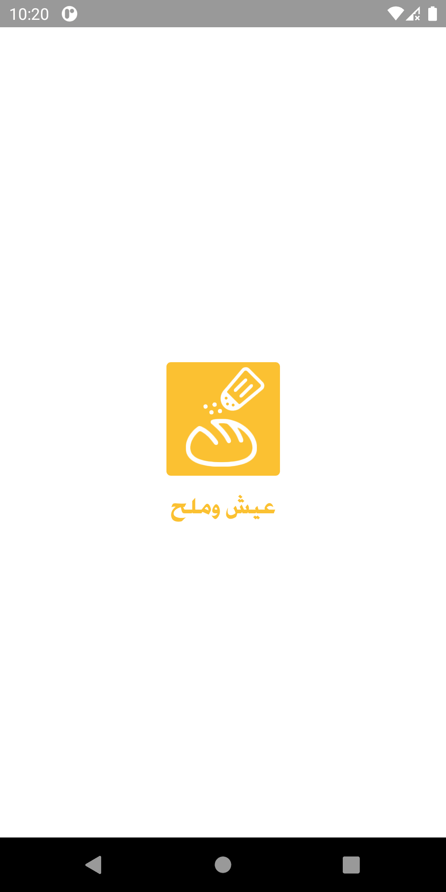

<div align="center">
  <a href="https://play.google.com/store/apps/details?id=com.ma7moud3ly.makeyourbook" target="_blank">
    
  </a>

# SHERBINYAT شربينيات 
Food Recipe application..
</div>


<div align="center">
<br>
<br>
<div>
  
  
</div>
<br>
<div>
  
  
</div>
<br>


</div><div align="left">
  
### Technologies:
<li>Kotlin</li>
<li>MVVM architecture</li>
<li>Data/View binding</li>
<li>Material components</li>

### Third parties:
- Retorfit
- Picasso
- (UStoreLibrary)[https://github.com/Ma7moud3ly/UStoreLibrary]

### How To Run
<div align="left">

- clone the repo

- ```git clone https://github.com/Ma7moud3ly/recipe-app.git```

- then open an existing app with android studio..build..run.
- or goto the repo directory and bulid with gradle

- ```gradlew assembleDebug```

- finally install and run in the emulator..

- ```gradlew installDebug```

</div>

<br>
[Download]()
</div>
