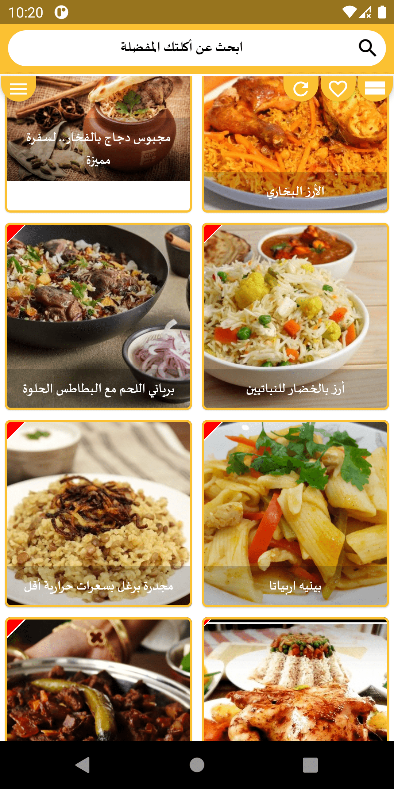
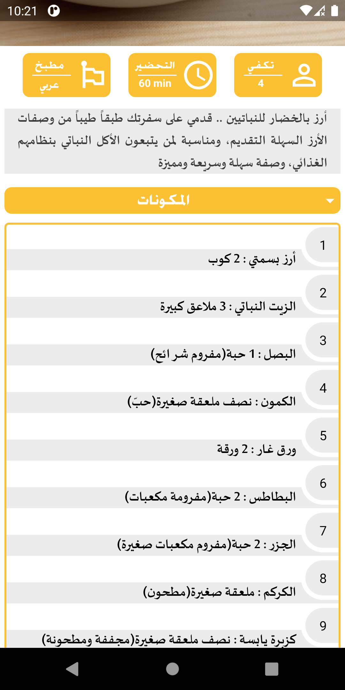
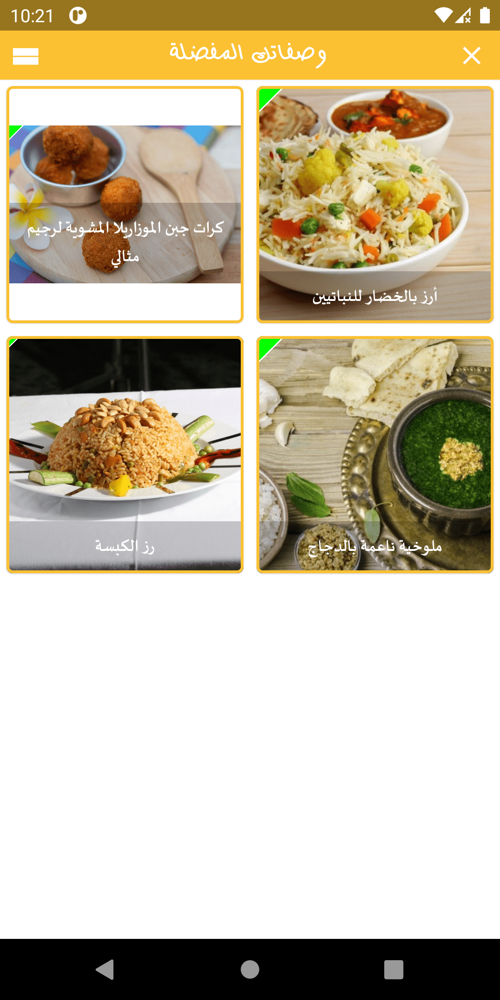
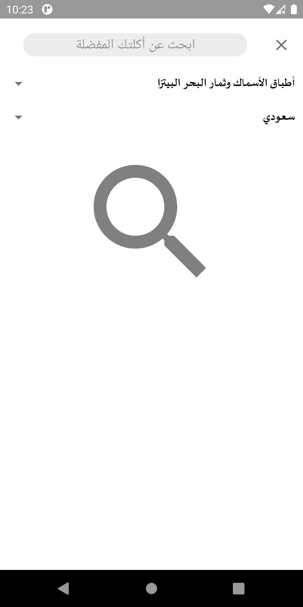

  

# عيش وملح 
A recipe application comes with thousands of famous food recipes with step by step instructions and accurate ingredients guide. 

 
 

  
  
  

 

  
  
  

 

  
  

 

  
### Technologies:
<li>Kotlin</li>
<li>MVVM architecture</li>
<li>Kotlin coroutins and live data</li>
<li>Data/View binding</li>
<li>Room Database</li>
<li>Material components</li>

### Third parties:
- Retorfit
- Picasso

### more..
- Python used for recipes scrapping.
- Node.js used for building the web service

 
[Download](https://play.google.com/store/apps/details?id=com.ma7moud3ly.akla)

